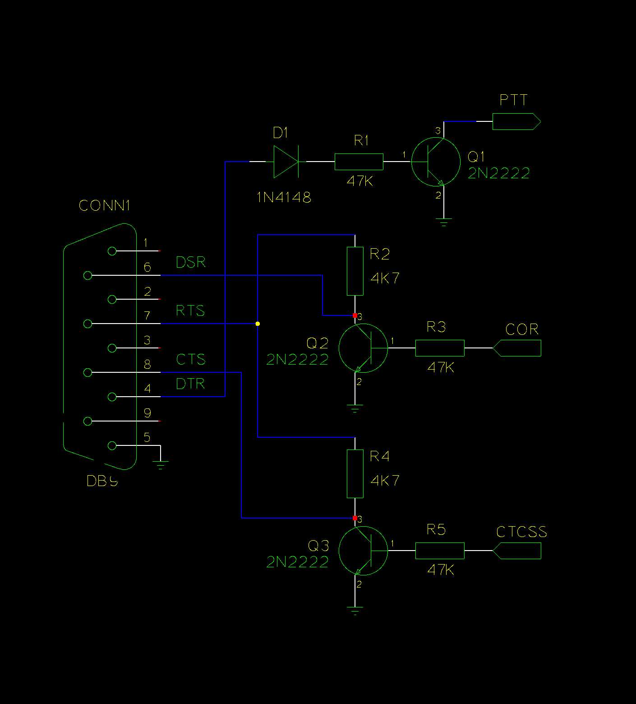
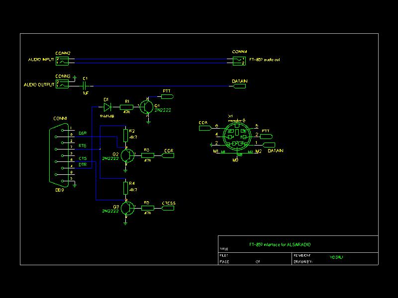
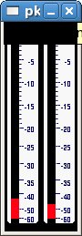

Forked from YU3IIO:
https://yo3iiu.ro/blog/?p=315
https://yo3iiu.ro/blog/?p=324
https://yo3iiu.ro/blog/?p=361

The idea behind is that I wanted to make a channel driver that uses a general purpose sound card for media path and serial port for signaling. If the card has a driver for Linux then [ALSA](http://www.alsa-project.org/) (Advanced Linux Sound Architecture) will provide an abstraction of it so that the channel driver will not depend on the specific sound card type.

On the signaling side, the serial port is used to send PTT signal and receive COR (or COS) and CTCSS from an external decoder (if needed only). The simplest serial interface to the radio station is presented bellow:

It does not use the right levels for RS232 interface but it will work with the serial ports of modern computers as long as the PTT and COR are not stressed with high data rate (this is unlikely anyway). I will provide later on an interface that will make use of optocouplers for isolation of signals and audio transformers for isolation of media path.

Audio signals (media path) are connected form the audio output of the rig to soundcard input and from soundcard output to rig microphone input.

The new channel driver is called **alsaradio** and corresponding module is named **chan_alsaradio.so**. Like all the other channel drivers it has a configuration file in which one could give various options. Here is a typical **alsaradio.conf** file which should be placed where all asterisk config files are: **/etc/asterisk/**

**alsaradio.conf**

[ard0]

input_device=plughw:0,0

output_device=plughw:0,0

serial_device=/dev/ttyS0

[general]

carrierfrom=serialdsr

You should use appropriate values for your input_device and output_device parameters according to configuration of your sound card.

Here is a relevant portion from **rpt.conf** that uses the alsaradio channel driver:

**rpt.conf**

[xxxxxx – here is your node number]

rxchannel=alsaradio/ard0

Here is a echolink.conf that will make app_rpt communicate with Echolink servers:

**echolink.conf**

[el0]

confmode=no

call=YO3IIU

pwd=your Echolink password

name=your name

qth=your qth

email=your e-mail

maxstns=20

rtcptimeout=10

node=your node number

context=radio-secure

server1=server1.echolink.org

server2=server2.echolink.org

server3=server3.echolink.org

If you’ve proper configured the app_rpt, alsaradio and echolink and connected the radio to the PC then you should be able to key in and dial using DTMF a number from another radio tuned to the frequency of your main radio. Alsaradio is able to decode the DTMF and send them to app_rpt. For example if you want to connect to *ECHOTEST* (node number 9999) you should dial:

*33009999

I will explain later about how various nod numbers could be dialed using DTMF commands.

**irlp.conf**

node =stn5667  #the IRLP node number you will obtain during installation

call=yo3iiu

rtcptimeout=10

localispeakerport=2174

radmod=no

audioport=2074

context=radio-secure

astnode=27235 #your Allstarlink node number

Dialing an IRLP number like 9500:

*349500

if you obtained an Allstarlink node number too, you would be able to dial for example number 27235 with the following command:

*327235
**Practical details:**

There are some things you need to tweak in order to make app_rpt and **alsaradio** working as a repeater and Echolink node.

**Hardware:**

I’m using FT-857D to build the repeater. The connection between PC and radio station is signaling and audio. For signaling I’m using the DATA connector on the back which is a mini DIN 6 pin:

  

The PTT is activated low and needs very low current to be activated. I measured about 140uA needed current for activating PTT.

The SQL signal (which sometimes is called **COR** – **C**arrier **O**perated **R**elay or **COS** – **C**arrier **O**perated **S**quelch) is activated high but it can only drive small current (uA) and therefore a transistor needs to be used to drive the serial line. That is why one will need an additional power supply if driving optocoupler is needed in an isolated interface (I’ll present it later on).

You could see that the DATA connector has DATA IN, DATA OUT 1200 and DATA OUT 9600 pins which could be used to input/output audio when no digital modes are used. However, DATA OUT pins do not output squelched audio. Hence I used only DATA IN for audio input and oudio output has been taken from oudio output jack in the back of the rig.

**Audio adjustments:**

A good level meter for ALSA is [ameter](http:// "http://laugeo.free.fr/ameter.html"). It is an ALSA plugin that will get the PCM level to from sound card and display it in a graphical environment. Download, build and install it as per given instructions.  The following is an screenshot of ameter GUI:

To adjust input level just use arecord with the following command:

arecord -D ameter -c 2 -f S16_LE test.waw

It will record the input level while showing ameter levels. You should adjust input level either from your card controls or from your rig’s volume level to see a 3/4 from your maximum ameter level.

To adjust output level you need to set your rig to display modulation level. Then adjust your card output level so that the modulation level is what your rig’s manual says (On FT-857 you should see couple of bars at maximum).

**Testing the system:**

If you start asterisk and signaling and media path are connected then you should be able to do the following from another radio station with a DTMF pad:

– activate parrot mode (simplex repeater functionality): *94 – now all you speak is sent back to you

– deactivate parrot mode: *95

– get system time: *81

– get version of the system: *82

– *3 – conects to an internet node (needs parrot mode disabled)

– *1 – disconnects from an internet node

All of the above DTMF sequences are configured in the **rpt.conf** and you coud add more, see app_rpt documentation.

**Connecting to Echolink:**

The Echolink numbers are prefixed with digit 3 and padded with 0 until 7 digits.

– *33009999 – this will conect to *ECHOTEST* node

– *13009999 – will disconnect from *ECHOTEST* node

**Connecting to Allstarlink:**

The Allstarlink numbers are starting by default with digit 2 and there is no need to prefix anything:

– *31234 conencts to Allstarlink number 1234

– *11234 disconnects from the Allstarlink number 1234

**Connecting to IRLP:**

The IRLP node numbers are prefixed with digit 4 and no padding.

– *349500 – connects to IRLP node 9500

– *149500 – disconnects from IRLP node 9500

**Testing from Asterisk’s CLI:**

DTMF commands could also be sent from the asterisk’s console. Start asterisk CLI with “asterisk -r” and then you should be able to do the same, for example:

rpt fun *94 – activate parrot mode

rpt fun *95 – deactivate parrot mode

**Other commands useful for testing from CLI:**

database show – shows database with Echolink nodes

aradio key – keys the transmitter

aradio unkey – unkeys the transmitter

aradio rkey – simulates COR present

aradio runkey – seize COR present

_**Sourcecode released as Open Source under GNU GPL license:**_

example of alsaradio.conf: [alsaradio.conf](alsaradio.conf)

example of rpt.conf: [rpt.conf](rpt.conf)

chan alsaradio (v02): [chan_alsaradio.c](chan_alsaradio.c)

To correctly build the chan_alsaradio driver, the following line needs to be added in channels/Makefile:

chan_alsaradio.so: LIBS+=-lasound
